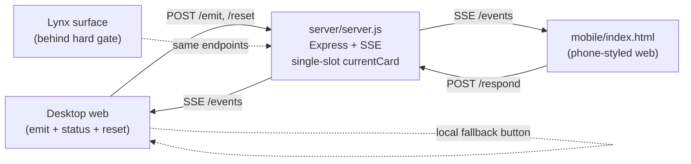

# PocketTrae MVP plan

> Browser-first cross-device Action Card workflow. Express + SSE + POST relay; **single active card**; desktop and mobile-styled web surfaces share **one pure schema**; note field shipped **before any Lynx work**; Lynx gated behind four explicit demo-readiness checks.

## Final scope (locked, v1)

- Desktop web surface emits one DeployApproval card and updates live when mobile responds.
- **Exactly one active card** at a time (single-slot in-memory state). Emitting a new card replaces the active one.
- One shared `ActionCard` schema, **pure data + pure functions only** — no I/O, no DOM, no fetch, no globals.
- Mobile surface = **mobile-styled web page first** + **Lynx port later, gated**.
- Transport = **SSE for server->client + POST for client->server** + **desktop local fallback button**.
- **Demo reset path**: one click on desktop wipes state and preloads the canonical DeployApproval card.
- One scripted demo path: reset -> emit -> render on mobile -> tap Approve + note -> desktop flips to "Deployment triggered via mobile approval."

## Architecture

## First-pass file plan (5 files only)

- `server/server.js` — Express on `:3000`; `GET /events` (SSE), `POST /emit`, `POST /respond`, `POST /reset`, `GET /state`; single-slot `currentCard` variable (not a Map); serves `desktop/` and `mobile/` as static. Imports pure helpers from `shared/actionCard.js`.
- `shared/actionCard.js` — **pure data + pure functions only.** Exports: status enum, `makeCard({type, title, body, actions})`, `respondToCard(card, {actionId, note, respondedBy})`, `makeDeployApproval()` factory used by reset/preload. No `fetch`, no `document`, no `window`, no timers, no side effects. Importable identically by Node and browser via `<script type="module">`.
- `desktop/index.html` — single file. Emit button, live status panel, EventSource subscriber, **local-fallback button**, **Reset demo button**.
- `mobile/index.html` — single file. Phone-viewport meta, single-card view, Approve/Reject buttons, **note textarea**, EventSource subscriber, POST /respond.
- `package.json` — `"type": "module"`, dep `express`, `"start": "node server/server.js"`.

**Deferred** (only after Lynx gate or polish phase): README, seed scripts, Lynx scaffold, QR, styling pass, second card type.

## Execution plan (time-boxed)

- **0-20 min — Step 1: Desktop shell.** `package.json`, `shared/actionCard.js` (pure), `desktop/index.html` rendering a hardcoded card with status toggle. No server.
- **20-35 min — Step 2: Mobile shell.** `mobile/index.html` rendering same hardcoded card with Approve/Reject buttons.
- **35-55 min — Step 3: Relay transport + reset.** `server/server.js` with SSE + `POST /emit` + `POST /respond` + `POST /reset` (clears state, preloads `makeDeployApproval()`) + single-slot `currentCard`. Smoke test via curl.
- **55-75 min — Step 4: End-to-end.** Desktop Emit -> POST /emit; both pages on `EventSource('/events')`; mobile Approve/Reject -> POST /respond; desktop flips live. **This is the demo.**
- **75-90 min — Step 5: Fallback + reset UI.** Desktop "Simulate mobile approval (local)" button (uses pure `respondToCard` from shared, no network) + "Reset demo" button (POST /reset).
- **90-105 min — Step 6: Note field.** Textarea on mobile, included in respond payload, rendered on desktop card. **Required before Lynx.**
- **── Hard gate ──** see below.
- **+60-90 min — Step 8: Lynx port** (only if gate passes).

## Build order

1. Desktop shell (local state only)
2. Mobile-styled web shell (local state only)
3. Tiny local relay transport (Express + SSE + POST + reset)
4. End-to-end approve/reject flow
5. Desktop local fallback button + Reset demo button
6. Note field
7. **Hard gate check** (see below)
8. Lynx surface (only if gate passes)
9. Optional polish: README, QR, second card type, styling

## Hard gate before Lynx (all four must be true)

Lynx work does not start until every box below is confirmed live, in this order:

1. **Browser desktop works.** Emit, status panel update, reset, and fallback button all behave correctly on the laptop.
2. **Browser mobile works on an actual phone over LAN.** Not the simulator, not a second laptop tab — a real phone hitting `http://<laptop-LAN-IP>:3000/mobile/` and rendering the card.
3. **Approve flow works end-to-end.** Desktop emit -> phone renders -> phone Approve with a note -> desktop flips to "Deployment triggered via mobile approval." with the note visible.
4. **Fallback button works with network disabled.** Toggle Wi-Fi off on the laptop; the desktop "Simulate mobile approval" button still flips desktop state correctly using only the pure shared schema.

If any of the four fails, fix it first. Do not scaffold Lynx until all four pass in a clean run.

## Tradeoffs

- **Single active card, not a Map.** Smaller state surface, trivial to reset, matches the actual demo. Multi-card is post-MVP.
- **Pure shared module.** No transport coupling means it works identically in Node, browser, and (later) Lynx with zero changes.
- **Reset endpoint is server-side.** Both clients re-render automatically via SSE — no client-side reset logic needed.
- **State-first, transport-second.** Steps 1-2 ship visual progress without any server.
- **Inline scripts, no bundler.** Zero build step.
- **In-memory store, single port.** One URL on stage, easy reset (kill server or hit /reset).
- **Note field is non-negotiable pre-Lynx.** It's part of the canonical demo line and trivial to add; deferring it past Lynx risks shipping an incomplete demo if Lynx eats time.

## Stop points (pause and confirm at each)

- After Step 2: "two browser tabs render the card UI from the pure shared schema."
- After Step 4: "approve in mobile tab, desktop flips live."
- After Step 5: "reset button reloads the canonical card; fallback button works with server killed."
- After Step 6: "note from mobile appears on desktop."
- **Before Step 8: explicit four-box Lynx gate check.**

## Risks + mitigations

- SSE blocked by some corp proxy -> not a concern on localhost/LAN; if it bites in Lynx later, switch that one client to short-poll `/state`.
- Conference Wi-Fi blocks phone-to-laptop -> desktop fallback + reset cover it; demo from two browser tabs on the laptop if needed.
- State desync -> server is source of truth, every SSE event sends the full card; clients fully re-render.
- Lynx Rspeedy setup time -> deferred behind the hard gate; demo already works without it.
- Schema drift between surfaces -> single pure module imported by all three (server, desktop, mobile, later Lynx).
